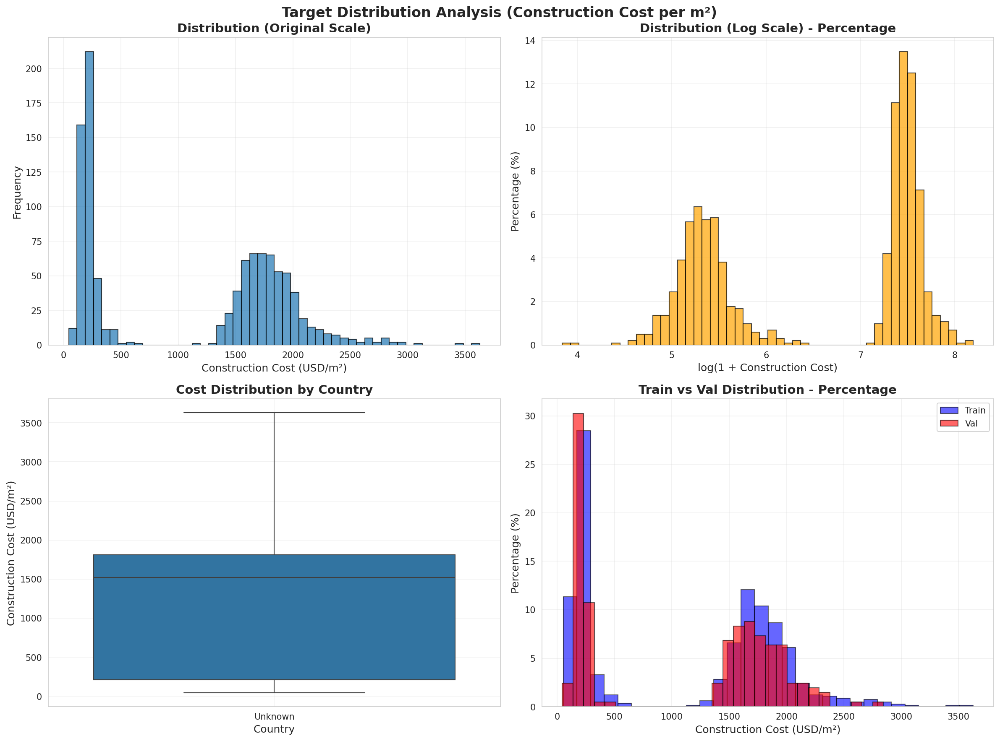
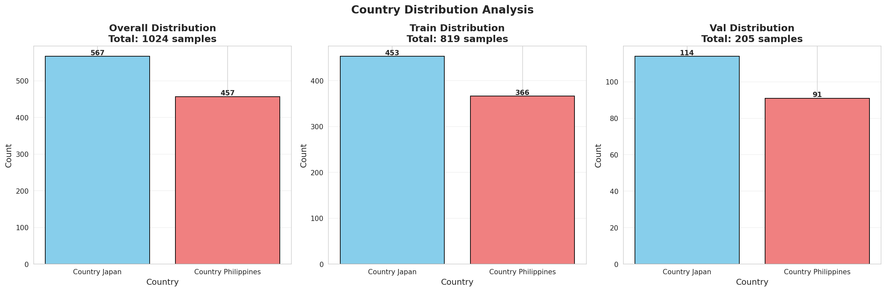
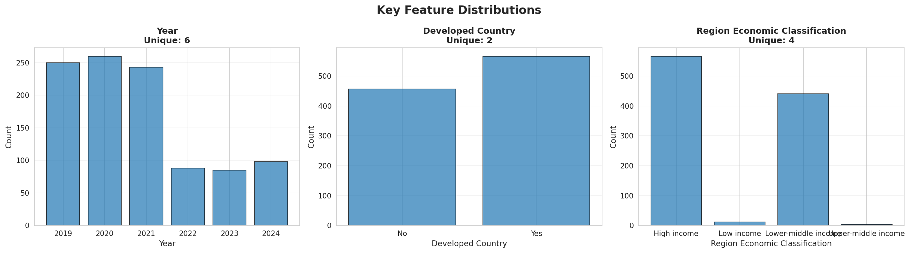
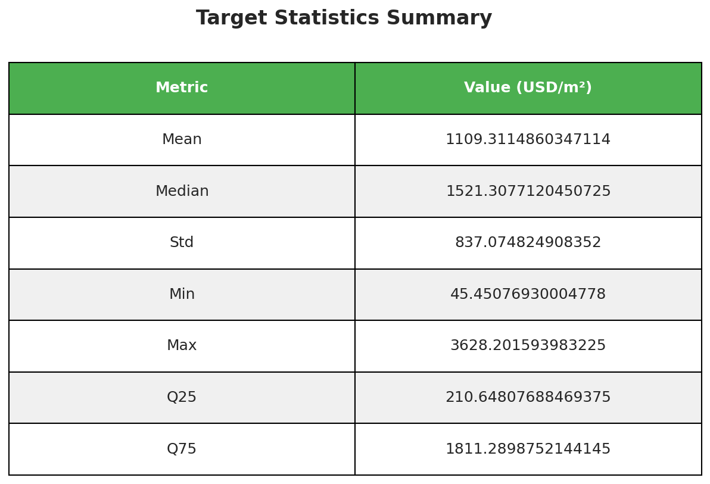
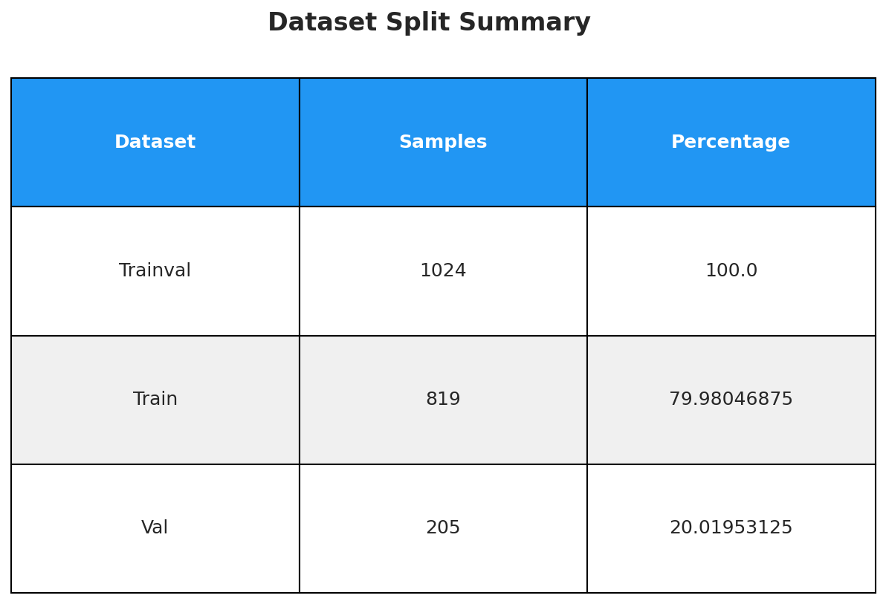
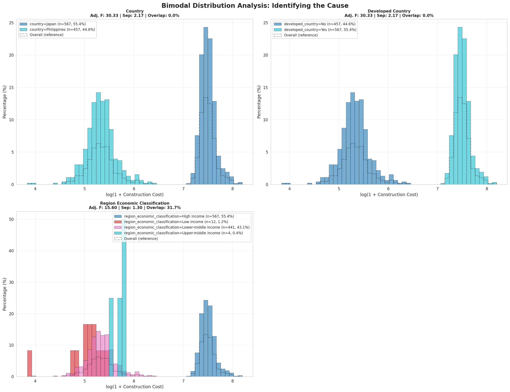

# Construction Cost Per Square Meter Estimation

A machine learning competition project for estimating construction costs using economic data and satellite-derived features.

For more information, visit the [solafune competition](https://solafune.com/competitions/1918ccd7-eb06-4cfc-822f-a9823c63b2c1?menu=about&tab=overview).

## Overview

Estimating construction costs accurately is essential for urban planning, infrastructure investment, and risk management in both public and private sectors. Traditional cost estimation methods often rely on limited survey data, outdated price indices, or subjective expert judgment, making them slow to update and difficult to scale across regions. At the same time, rapid changes in material prices, labor markets, and development patterns can quickly erode the reliability of static models.

This project integrates macroeconomic indicators with detailed remote sensing observations—such as land use, building density, and development intensity—to provide more granular, timely, and objective estimates of construction cost per square meter. The goal is to build robust models that can generalize across countries and economic cycles, and remain stable when exposed to noisy, heterogeneous real-world data.

## Competition Details

**Platform:** Solafune Competition Platform

**Objective:** Build and validate regression models that produce accurate, spatially aware cost estimates under diverse conditions using a combination of economic data and satellite-derived features.

**Applications:**
- Insurance
- Disaster recovery
- Infrastructure planning
- Housing policy

**Evaluation Criteria:**
- Accuracy
- Robustness across regions and time periods
- Ability to handle outliers and data sparsity

## Prizes

**Total Prize Pool: $12,000**

- 🥇 1st place: $4,000
- 🥈 2nd place: $2,500
- 🥉 3rd place: $2,000
- 4th place: $1,000
- 5th place: $500

**Additional Awards:**
- **Discussion Award:** $1,000 USD - For the topic that receives the most votes from prize winners
- **Solafune Award:** $1,000 USD - For content judged to have made the most contribution to the competition
- **Solafune Tools Award:** Solafune original items - For improvements or tools that impact the competition

## Dataset Overview

### Data Sources

**Economic Data:**
- Statistical Survey of Construction Starts (Japan) | License: PDL 1.0
- Construction Statistics from Approved Building Permits (Philippines) | License: CC BY 4.0

**Remote Sensing Data:**
- Sentinel-2: Level-2A | License: Copernicus Sentinel Data Policy
- VIIRS Stray Light Corrected Nighttime Day | License: Public Domain

### Dataset Format

#### Sentinel-2 L2A Data

The Sentinel-2 Multi-Spectral Instrument, Level-2A images contain information on 12 bands:

- `B1`, `B2`, `B3`, `B4`, `B5`, `B6`, `B7`, `B8`, `B8A`, `B9`, `B11`, `B12`

**Processing Details:**
- Images processed from 2019/01/01 to 2024/12/31
- Cloud masking applied
- Median composite per quarter of the year used for each location
- Geographically clipped using GAUL2024

For more information, visit the [Sentinel-2 documentation](https://sentinels.copernicus.eu/web/sentinel/user-guides/sentinel-2-msi).

#### VIIRS Data

**Band Information:**
- Single band: `avg_rad` (Average DNB Radiance)

**Processing Details:**
- Images processed from 2019/01/01 to 2024/12/31
- Median composite per quarter of the year used for each location
- Geographically clipped using GAUL2024

### Training Data Format

The training CSV contains the following columns:

| Column | Description |
|--------|-------------|
| `data_id` | Unique identifier for each data point |
| `geolocation_name` | Name of the geographic location |
| `quarter_label` | Quarter label (time period) |
| `country` | Country name |
| `year` | Year |
| `deflated_gdp_usd` | Deflated GDP in USD |
| `us_cpi` | US Consumer Price Index |
| `developed_country` | Indicator for developed country status |
| `landlocked` | Landlocked country indicator |
| `region_economic_classification` | Economic classification of the region |
| `access_to_airport` | Airport access indicator |
| `access_to_port` | Port access indicator |
| `access_to_highway` | Highway access indicator |
| `access_to_railway` | Railway access indicator |
| `straight_distance_to_capital_km` | Straight-line distance to capital in kilometers |
| `seismic_hazard_zone` | Seismic hazard zone classification |
| `flood_risk_class` | Flood risk classification |
| `tropical_cyclone_wind_risk` | Tropical cyclone wind risk |
| `tornadoes_wind_risk` | Tornado wind risk |
| `koppen_climate_zone` | Köppen climate zone classification |
| `sentinel2_tiff_file_name` | Sentinel-2 TIFF file name |
| `viirs_tiff_file_name` | VIIRS TIFF file name |
| `construction_cost_per_m2_usd` | **Target variable** - Construction cost per square meter in USD |

## Submission Format

Submissions should consist of one file in CSV format. The file must adhere to the prescribed format and reference the training data and sample submission CSV.

**Sample submission file:** `sample_submission_a88ad1763fb94d3d9eb923c68b142d6f.csv`

## Solafune-Tools

[Solafune-Tools](https://github.com/Solafune-Tools) is an open-source repository that provides internal geodata creation and management tools. This package includes functionalities to:

- Download STAC catalogs and Sentinel-2 imagery from the Planetary Computer
- Assemble images into cloudless mosaics
- Access evaluation functions and submission verification tools

### Contributing to Solafune-Tools

We welcome and encourage contributions from the community. To share your tools or functions:

1. **Fork the Repository:** Begin by forking the [Solafune-Tools repository](https://github.com/Solafune-Tools) to your GitHub account
2. **Add Your Tools:** Place your tools or functions in the `solafune_tools/community_tools` directory within your forked repository
3. **Submit a Pull Request:** After adding your contributions, submit a pull request to the original Solafune-Tools repository
4. **Integration:** Upon review and approval, your tools will be integrated into Solafune-Tools, making them available for all users

**Note:** To be eligible for the Solafune Tools Award, you must:
- Submit improvements or tools as a pull request to Solafune-Tools
- Publish a discussion topic about your commits
- Demonstrate that your improvements impact users' scores on the leaderboard

## Project Structure

```
Construction_Cost_Prediction/
├── data/
│   ├── train_dataset_*.zip          # Training dataset
│   ├── evaluation_dataset_*.zip    # Evaluation dataset
│   ├── trainval_tabular.csv         # Original trainval CSV (before split)
│   ├── trainval_composite/          # Satellite imagery for train/val sets
│   └── test_composite/              # Satellite imagery for test set
│
├── data/annotation/                 # Preprocessed data (created by preprocessing)
│   ├── trainval/                   # Unified trainval set (for k-fold cross-validation)
│   │   ├── trainval_clean.csv
│   │   └── trainval_clean_metadata.pkl
│   ├── train/
│   │   ├── train_clean.csv          # Training set (from trainval split, has ground truth)
│   │   └── train_clean_metadata.pkl # Training metadata
│   ├── val/
│   │   ├── val_clean.csv            # Validation set (from trainval split, has ground truth)
│   │   └── val_clean_metadata.pkl   # Validation metadata
│   ├── test/
│   │   ├── test_clean.csv           # Test set (NO ground truth, only for final inference)
│   │   └── test_clean_metadata.pkl  # Test metadata
│   └── field_lengths.pt             # Tabular field lengths (for TIP encoder)
```

### Data Structure Explanation

**Preprocessing Flow:**
1. **Input:** `trainval_tabular.csv` (contains all training data with ground truth)
2. **Preprocess entire trainval:** Creates unified trainval set for k-fold cross-validation:
   - `trainval/trainval_clean.csv` + `trainval_clean_metadata.pkl` → uses `trainval_composite/`
3. **Split:** Preprocessing splits `trainval_tabular.csv` into:
   - `train/train_clean.csv` (80% of trainval, has ground truth) → uses `trainval_composite/`
   - `val/val_clean.csv` (20% of trainval, has ground truth) → uses `trainval_composite/`
4. **Test:** `test/test_clean.csv` (separate file, NO ground truth, only for final submission) → uses `test_composite/`

**Composite Folder Mapping:**
- **`trainval_composite/`**: Contains satellite TIFF files for **both** train and val sets
  - Used by: `train_clean.csv` and `val_clean.csv`
  - Both CSV files reference filenames that exist in this folder
- **`test_composite/`**: Contains satellite TIFF files for test set only
  - Used by: `test_clean.csv`
  - Test CSV references filenames that exist in this folder

**Important Notes:**
- ✅ **For training/fine-tuning:** Use `train_clean.csv` and `val_clean.csv` (both have ground truth)
- ✅ **For validation during training:** Use `val_clean.csv` (has ground truth for metrics)
- ❌ **Do NOT use `test_clean.csv` for training:** It has NO ground truth
- ✅ **For final inference:** Use `test_clean.csv` with `test_composite/` to generate submission
├── src/                             # Source code
│   ├── data/                       # Data loading utilities
│   ├── models/                     # Model implementations
│   └── utils/                      # Training utilities
├── config/                          # Configuration files
│   └── config.py                    # Training configuration
├── checkpoints/                     # Saved model checkpoints
├── outputs/                         # Training outputs and results
├── train.py                         # Main training script
├── requirements.txt                # Python dependencies
├── README.md                        # This file
├── MODEL_RECOMMENDATION.md         # Detailed model recommendations
├── FINETUNING_GUIDE.md             # Fine-tuning guide
└── QUICKSTART.md                   # Quick start guide
```

## Getting Started

1. **Extract the datasets:**
   ```bash
   unzip data/train_dataset_*.zip
   unzip data/evaluation_dataset_*.zip
   ```

2. **Explore the data:**
   - Review the training CSV to understand the feature structure
   - Load and visualize the Sentinel-2 and VIIRS imagery
   - Analyze the relationship between features and target variable

3. **Preprocess the data:**
   - Run the preprocessing script to clean and prepare tabular data
   - The script will print target normalization stats - add these to your config file
   - See [Preprocessing](#preprocessing) section below for details

4. **Build your model:**
   - Extract features from satellite imagery
   - Train regression models (consider ensemble methods)
   - Validate across different regions and time periods

4. **Submit predictions:**
   - Format predictions according to the sample submission file
   - Ensure all required columns are present
   - Submit via the competition platform

## Usage

### Installation

First, install the required dependencies:

```bash
pip install -r requirements.txt
```

### Preprocessing

Before training, you need to preprocess the tabular data. This script:
- **Splits trainval into train/val (80/20)**: Uses stratified split by `country` to maintain balanced distribution
- **Preprocesses entire trainval set** (creates `trainval/trainval_clean.csv` for k-fold cross-validation)
- Processes categorical and numerical features:
  - Handles missing values (mode for categorical, median for numerical)
  - Normalizes continuous features (z-score)
  - Encodes categorical features (label encoding)
  - Handles high-cardinality categoricals
- Generates metadata for consistent feature mapping
- **Creates data analysis visualizations**: Automatically generates 5 analysis plots in `data_analysis/` folder
- **Prints target normalization stats** that you must add to your config file
- Optionally checks if image files exist on disk

**Basic command:**
```bash
conda activate ccp
cd /hdd/hiep/CODE/Construction_Cost_Prediction
python src/data/preprocess_construction_cost.py \
    --annotation_dir data/annotation \
    --composite_dir_trainval data/trainval_composite \
    --composite_dir_test data/test_composite
```

**With file existence check:**
```bash
python src/data/preprocess_construction_cost.py \
    --annotation_dir data/annotation \
    --composite_dir_trainval data/trainval_composite \
    --composite_dir_test data/test_composite \
    --check_files
```

**What the preprocessing script does:**
1. **Splits trainval into train/val (80/20)**: Uses stratified split by `country` to maintain balanced distribution
2. **Preprocesses tabular data**:
   - Handles missing values (mode for categorical, median for numerical)
   - Normalizes continuous features (z-score)
   - Encodes categorical features (label encoding)
   - Handles high-cardinality categoricals
3. **Creates unified trainval set**: For k-fold cross-validation
4. **Generates data analysis plots**: Automatically creates visualization plots in `data_analysis/` folder:
   - Target distribution (original & log scale, by country, train vs val)
   - Country distribution (overall, train, val)
   - Key feature distributions
   - Target statistics summary
   - Dataset split summary

**Important:** After running preprocessing, the script will print target normalization statistics like:
```

target_mean: 6.513477  # Mean of log(1 + target) values
target_std: 1.101045   # Std of log(1 + target) values
target_log_transform: true
```

**You must copy these values to your config file** (`src/models/TIP/configs/config_construction_cost_pretrain.yaml`):
```yaml

target_mean: 6.513477  # Mean of log(1 + target) values
target_std: 1.101045   # Std of log(1 + target) values
target_log_transform: true
```

#### Preprocessing Options

```bash
python src/data/preprocess_construction_cost.py \
    --annotation_dir data/annotation \
    --composite_dir_trainval data/trainval_composite \
    --composite_dir_test data/test_composite \
    --trainval_csv data/annotation/trainval_tabular.csv \
    --test_csv data/annotation/test/test.csv \
    --categorical_threshold 50 \
    --handle_high_cardinality embedding \
    --imputation_strategy simple \
    --target_col construction_cost_per_m2_usd \
    --check_files  # Optional: check if image files exist
```

**Arguments:**
- `--annotation_dir`: Path to annotation directory (required)
- `--composite_dir_trainval`: Directory containing satellite TIFF files for train/val sets (required)
- `--composite_dir_test`: Directory containing satellite TIFF files for test set (required)
- `--check_files`: Check if image files actually exist on disk (optional flag)

**Output files:**
- `data/annotation/train/train_clean.csv` - Processed training data
- `data/annotation/train/train_clean_metadata.pkl` - Training metadata
- `data/annotation/val/val_clean.csv` - Processed validation data
- `data/annotation/val/val_clean_metadata.pkl` - Validation metadata
- `data/annotation/trainval/trainval_clean.csv` - Processed trainval data (for k-fold CV)
- `data/annotation/trainval/trainval_clean_metadata.pkl` - Trainval metadata
- `data/annotation/test/test_clean.csv` - Processed test data
- `data/annotation/test/test_clean_metadata.pkl` - Test metadata
- `data/annotation/field_lengths.pt` - Field lengths for TIP encoder
- `data/annotation/label_encoders.pkl` - Label encoders for categorical features
- `data/annotation/normalization_stats.pkl` - Normalization statistics for numerical features
#### Data Analysis Visualizations

The preprocessing script automatically generates comprehensive analysis plots saved to `data_analysis/` folder:

**1. Target Distribution Analysis**

- Shows distribution in original scale and log scale
- Compares train vs val distributions
- Box plot by country

**2. Country Distribution (Balanced Split Verification)**

- Verifies that stratified split maintains balanced country distribution
- Shows overall, train, and val distributions

**3. Key Feature Distributions**

- Distribution of important features (year, developed_country, etc.)

**4. Target Statistics Summary**

- Summary table with mean, median, std, min, max, quartiles

**5. Dataset Split Summary**

- Sample counts and percentages for trainval, train, and val

**6. Bimodal Distribution Analysis**

- Shows target distribution split by candidate features (country, developed_country, region_economic_classification)
- Uses percentage scale (0-100%) for easy comparison
- Displays multiple metrics: Adjusted F-Score, Mean Separation, Overlap %
- Identifies which feature best explains the two distinct cost patterns

**7. Feature Contribution Ranking**

- Bar chart comparing all separation metrics
- Ranks features by Adjusted F-Score
- Shows which feature creates the cleanest separation

#### Understanding the Bimodal Distribution Analysis

The construction cost data shows a **bimodal distribution** (two distinct patterns) in log space:
- **Pattern 1**: Lower costs (center ~5.3, range 4.5-6.5)
- **Pattern 2**: Higher costs (center ~7.5, range 7.0-8.2)

The analysis plots help identify **which feature is responsible** for this bimodal pattern:

**Plot 06 - Bimodal Analysis:**
- Shows the target distribution split by different candidate features (country, developed_country, region_economic_classification, etc.)
- Each subplot displays overlapping histograms for each category value
- **Separation Score** is calculated for each feature:
  - Formula: `Separation Score = Between-Group Variance / Within-Group Variance`
  - Higher score = Better separation = That feature explains more of the distribution difference
  - Similar to F-statistic in ANOVA

**Plot 07 - Feature Contribution:**
- Bar chart comparing separation scores across all candidate features
- Shows between-group variance (how different groups are) vs within-group variance (how similar within each group)
- **Ranking**: Features are sorted by separation score (highest = best explanation)
- **Interpretation**: The feature with the highest score is the primary driver of the bimodal distribution

**Metrics Used:**
1. **Adjusted F-Score** (primary): `F-statistic / log(n_groups)` - accounts for number of groups (higher=better)
2. **Mean Separation**: Average distance between group means in log space (higher=better, more interpretable)
3. **Overlap %**: Percentage of range overlap between groups (lower=better, 0%=perfect separation)
4. **Raw F-Statistic**: Between-group / Within-group variance (biased toward more groups, shown for reference)

**Example Results (from actual preprocessing):**
```
Ranking (by Adjusted F-Score):
  1. Country:
     Adjusted F-Score: 30.33
     Mean Separation: 2.17 (log units)
     Overlap: 0.0% ← Perfect separation!
  2. Developed Country:
     Adjusted F-Score: 30.33 (same as country - they're correlated)
     Mean Separation: 2.17
     Overlap: 0.0%
  3. Region Economic Classification:
     Adjusted F-Score: 15.60
     Mean Separation: 1.30
     Overlap: 31.7% ← Groups overlap significantly
```

**Interpretation:**
- **Country** and **Developed Country** have **0% overlap** = perfect separation (two distinct peaks, no overlap)
- **Region Economic Classification** has **31.7% overlap** = groups overlap significantly (worse separation)
- **Visual check matches metrics**: Country creates cleaner, more distinct patterns than Region Economic Classification
- **Conclusion**: Use `country` for stratified splitting (already implemented in preprocessing)

**Why Adjusted F-Score?**
- Raw F-statistic is biased toward features with more groups (e.g., 4 groups vs 2 groups)
- Adjusted F-Score divides by `log(n_groups)` to reduce this bias
- **Overlap %** is the most reliable metric: directly measures visual separation

**Example Preprocessing Output:**
```
📊 Step 0: Splitting trainval into train/val
Total trainval samples: 1024
Stratifying by: country
  Train: 819 samples (80%) -> data/annotation/train/train.csv
  Val: 205 samples (20%) -> data/annotation/val/val.csv

📊 PREPROCESSING SUMMARY:
  - Total features (for model): 19
  - Categorical: 16 (cardinalities: [125, 24, 2, 6, 2, 2, 4, 2, 2, 2, 2, 3, 2, 4, 2, 7])
  - Numerical: 3
  - Samples: 1024 (trainval), 819 (train), 205 (val)

📊 TARGET NORMALIZATION STATS (from trainval):
target_mean: 6.530002  # Mean of log(1 + target) values
target_std: 1.105960   # Std of log(1 + target) values

📊 BIMODAL DISTRIBUTION ANALYSIS RESULTS:
Ranking (by Adjusted F-Score):
  1. Country:
     Adjusted F-Score: 30.33 (primary metric)
     Mean Separation: 2.17 (log units) - groups are 2.17 units apart
     Overlap: 0.0% ← Perfect separation! (two distinct peaks, no overlap)
  2. Developed Country:
     Adjusted F-Score: 30.33 (identical to country - perfectly correlated)
     Mean Separation: 2.17
     Overlap: 0.0%
  3. Region Economic Classification:
     Adjusted F-Score: 15.60 (lower score)
     Mean Separation: 1.30 (groups closer together)
     Overlap: 31.7% ← Groups overlap significantly (worse separation)

✅ Best Feature: Country
   - Creates perfect separation (0% overlap) = two distinct, non-overlapping peaks
   - Mean separation of 2.17 log units = groups are clearly separated
   - Visual check confirms: Country creates the cleanest bimodal pattern
   - **Conclusion**: Use `country` for stratified splitting (already implemented)
```

**Key Findings:**
- **Region Economic Classification** has the highest separation score (21.63), meaning it best explains the two distinct cost patterns
- **Country** and **Developed Country** have identical scores (21.03), suggesting they're highly correlated
- The preprocessing uses **union cardinality** approach: categorical encoders are fitted on the union of train+val values to handle all possible categories
- **Target normalization stats** are computed from the full trainval set and should be added to the config file

### Training

The training script uses Hydra configuration system. All parameters are defined in `src/models/TIP/configs/config_construction_cost_pretrain.yaml` and can be overridden via command-line arguments.

**Important:** Make sure you have:
1. ✅ Run preprocessing and added `target_mean` and `target_std` to the config file
2. ✅ Set up WandB (if using) with your project and entity names

#### Basic Training (Uses Default Config)

```bash
conda activate ccp
cd /hdd/hiep/CODE/Construction_Cost_Prediction/src/models/TIP
python run.py
```

#### Training with Custom Parameters

You can override any config parameter via command-line:

```bash
conda activate ccp
cd /hdd/hiep/CODE/Construction_Cost_Prediction/src/models/TIP
python run.py \
    batch_size=32 \
    max_epochs=100 \
    lr=3e-4 \
    pretrain=True
```

#### Recommended Training Command

```bash
conda activate ccp
cd /hdd/hiep/CODE/Construction_Cost_Prediction/src/models/TIP


python -u run.py pretrain=True
```
All pretrained models are automatically downloaded when first used.

### Fine-Tuning (Stage 2)

After pretraining, fine-tune the regression head on the frozen pretrained backbone:

**Basic Fine-Tuning Command:**

**Recommended Fine-Tuning Command:**
```bash
conda activate ccp
cd /hdd/hiep/CODE/Construction_Cost_Prediction/src/models/TIP

python -u run.py \
    --config-name=config_construction_cost_finetune \
    finetune=True 
```

**Note:** The checkpoint path must be an **absolute path** or relative to the project root. Since the script runs from `src/models/TIP`, use absolute paths like `/hdd/hiep/CODE/Construction_Cost_Prediction/work_dir/runs/...`

**Note:** The `finetune=True` flag is already set in the fine-tuning config, but it's good practice to include it explicitly in the command for clarity. You can also override other config parameters like `batch_size`, `max_epochs`, `lr_eval`, etc.

**Fine-Tuning Strategy:**
- **Frozen Backbone**: The entire pretrained backbone (image encoder, tabular encoder, multimodal encoder) is frozen
- **Trainable Head**: Only the regression head (classifier) is trained
- This approach is faster and requires less memory, while leveraging the pretrained representations

**Fine-Tuning Outputs:**
- Checkpoints saved to: `work_dir/runs/finetune/{wandb_run_name}/`
  - `checkpoint_best_rmsle.ckpt` - Best checkpoint based on validation RMSLE
- WandB logs: Training and validation metrics

**Key Config Parameters:**
- `checkpoint`: Path to pretrained checkpoint (required)
- `finetune_strategy`: Set to `frozen` to freeze backbone (default: `frozen`)
- `batch_size`: Batch size for fine-tuning (default: 16)
- `max_epochs`: Number of fine-tuning epochs (default: 50)
- `lr_eval`: Learning rate for regression head (default: 1e-4)
- `target_mean`: Target normalization mean (must match pretrain config)
- `target_std`: Target normalization std (must match pretrain config)
- `eval_metric`: Metric to monitor (`mae`, `rmse`, `r2`)

**Note:** 
- The fine-tuning config (`config_construction_cost_finetune.yaml`) must have the same `target_mean` and `target_std` as the pretraining config
- Only the regression head weights are updated during fine-tuning
- The pretrained backbone remains frozen to preserve learned representations

### Evaluation

After training, you can evaluate your model on the validation set and generate predictions for the test set:

**Using the evaluation script:**
```bash
conda activate ccp
cd /hdd/hiep/CODE/Construction_Cost_Prediction
./run_evaluation.sh
```

**Or run directly:**
```bash
cd /hdd/hiep/CODE/Construction_Cost_Prediction/src/models/TIP
python trainers/evaluate_construction_cost.py \
    --checkpoint work_dir/runs/pretrain/tip_pretrain_*/checkpoint_best_rmsle_*.ckpt \
    --val_csv /hdd/hiep/CODE/Construction_Cost_Prediction/data/annotation/val/val_clean.csv \
    --test_csv /hdd/hiep/CODE/Construction_Cost_Prediction/data/annotation/test/test_clean.csv \
    --composite_dir_trainval /hdd/hiep/CODE/Construction_Cost_Prediction/data/trainval_composite \
    --composite_dir_test /hdd/hiep/CODE/Construction_Cost_Prediction/data/test_composite \
    --field_lengths /hdd/hiep/CODE/Construction_Cost_Prediction/data/annotation/field_lengths.pt \
    --val_metadata /hdd/hiep/CODE/Construction_Cost_Prediction/data/annotation/val/val_clean_metadata.pkl \
    --test_metadata /hdd/hiep/CODE/Construction_Cost_Prediction/data/annotation/test/test_clean_metadata.pkl \
    --output_dir work_dir/evaluation \
    --batch_size 32 \
    --num_workers 4 \
    --device cuda
```

**Evaluation outputs:**
- `val_predictions_{checkpoint_name}_{timestamp}.csv` - Validation predictions with ground truth
- `submission_{checkpoint_name}_{timestamp}.csv` - Test set predictions for submission
- Validation metrics (RMSLE, MAE, RMSE, R²) printed to console

**Important:** 
- `--composite_dir_trainval`: Directory containing satellite images for train/val sets (required)
- `--composite_dir_test`: Directory containing satellite images for test set (required)
- Both directories must be specified separately

### Command Line Arguments

The training script supports command-line arguments to override config defaults:

**Data arguments:**
- `--train_csv`: Path to training CSV file (default: `data/train_tabular.csv`)
- Note: Composite directories are specified in config files:
  - `composite_dir_trainval`: For train/val sets (in pretrain config)
  - `composite_dir_test`: For test set (in finetune config)

**Output arguments:**
- `--work_dir`: Base directory for all outputs (default: `workdir`)
  - Creates timestamped subdirectory: `workdir/YYYYMMDD_HHMMSS/`
  - All outputs (checkpoints, logs, config, history) saved here

**Training arguments:**
- `--batch_size`: Batch size for training (default: 8)
- `--epochs`: Number of training epochs (default: 100)
- `--device`: Device to use (`cuda` or `cpu`, default: `cuda`)

**Config file:**
- `--config`: Path to custom JSON config file (optional)

For all other parameters, modify `config/config.py` or create a custom config JSON file.

## Key Considerations

- **Robustness:** Models should perform well across different countries, regions, and time periods
- **Outlier Handling:** The model should be resilient to noisy and heterogeneous data
- **Feature Engineering:** Consider both economic indicators and satellite-derived features
- **Spatial Awareness:** Leverage geographic and infrastructure access features
- **Temporal Stability:** Account for economic cycles and temporal trends

## Model Recommendations

For detailed model recommendations and architecture suggestions, please see [MODEL_RECOMMENDATION.md](MODEL_RECOMMENDATION.md).

The document covers:
- Tabular data models (LightGBM, XGBoost, CatBoost, etc.)
- Satellite imagery models (ResNet, EfficientNet, ViT, etc.)
- Multi-modal fusion strategies
- Ensemble approaches
- Evaluation strategies
- Quick start recommendations

## Resources

- [Solafune Competition Platform](https://solafune.com)
- [Solafune-Tools GitHub Repository](https://github.com/Solafune-Tools)
- [Sentinel-2 Documentation](https://sentinels.copernicus.eu/web/sentinel/user-guides/sentinel-2-msi)
- [VIIRS Nighttime Lights](https://eogdata.mines.edu/products/vnl/)

## License

Please refer to the individual dataset licenses:
- Statistical Survey of Construction Starts (Japan): PDL 1.0
- Construction Statistics from Approved Building Permits (Philippines): CC BY 4.0
- Sentinel-2: Copernicus Sentinel Data Policy
- VIIRS: Public Domain

## Competition Terms

The potential winners will cooperate in the submission of:
- Source code
- URL of the solution write-up published in the competition discussion (for top 10 teams)

Prize money will be paid after:
- Completion of reproducibility inspection of the source code
- Identity verification

Please refer to the terms of participation for the conditions for receiving the prize money.

---

**Good luck with your submissions! 🚀**

